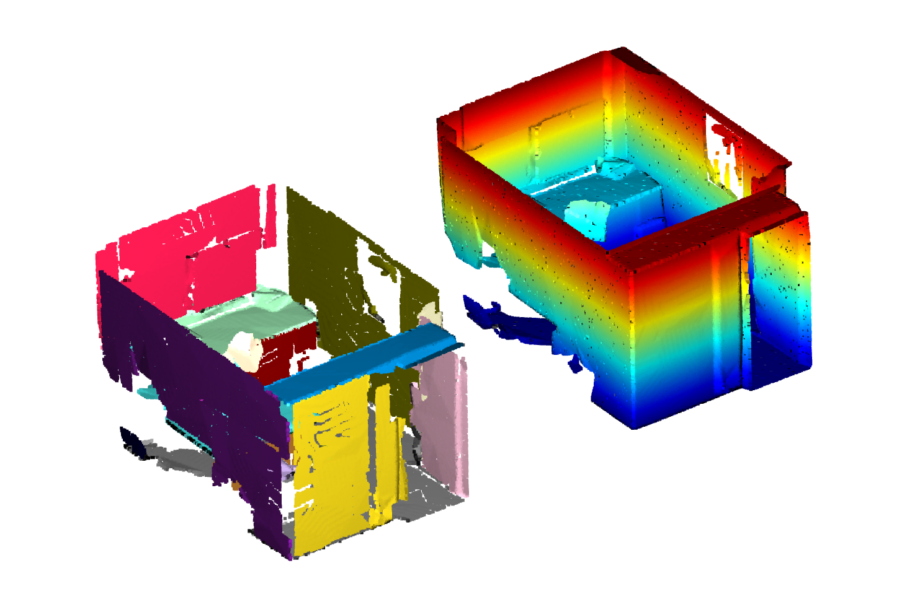

# RSPyD
Python Implementation of the RSPD plane detection algorithm proposed by Araùjo and Oliveira (2021).

The corresponding paper can be found here: https://www.inf.ufrgs.br/~oliveira/pubs_files/RE/RE.html

I am not affiliated with the authors.

## Installation and Dependencies

This python project depends on Open3D, NumPy, and SciPy.

To install, clone the repository and install using setuptools:
```
git clone git@github.com:lupeterm/RSPyD.git
python setup.py install
```

## Usage

Simply call `main.py` and pass appropriate arguments.

To view a demonstration of the algorithm's efficiency and precision, execute `main.py --example-scene`. This will run the algorithm on an office scene from the Stanford 2D-3D-Semantics Dataset.

Shown here is the output thereof, with the input cloud drawn on the right, and the detected planes on the left:

